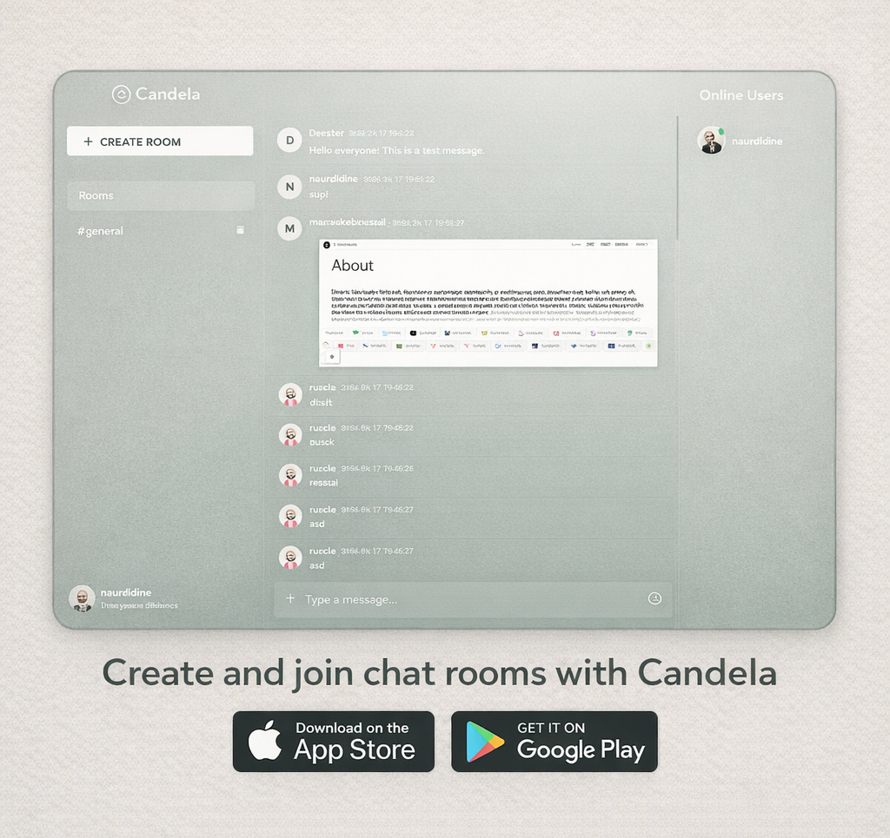

<p align="center">
  
</p>

<h1 align="center">Candela — Real-Time Chatroom</h1>

<p align="center">
  <strong>A premium, glassmorphism-styled chatroom web application built with Flask.</strong><br>
  Join rooms instantly as a guest, or register to unlock profile customization, avatars, and more.
</p>

<p align="center">
  
  
  
  
</p>

---

<p align="center">
  
</p>

---

## 📑 Table of Contents

- [Overview](#-overview)
- [Features](#-features)
- [Tech Stack](#-tech-stack)
- [Project Structure](#-project-structure)
- [Installation & Setup](#-installation--setup)
- [Running the App](#-running-the-app)
- [How It Works](#-how-it-works)
  - [Authentication System](#authentication-system)
  - [Room System](#room-system)
  - [Messaging](#messaging)
  - [Profile Management](#profile-management)
  - [Invitation System](#invitation-system)
- [API Endpoints](#-api-endpoints)
- [Data Storage](#-data-storage)
- [Design Philosophy](#-design-philosophy)
- [Screenshots](#-screenshots)
- [Contributing](#-contributing)
- [License](#-license)

---

## 🌟 Overview

**Candela** is a fully-featured, real-time chatroom web application designed with a **glassmorphism** aesthetic. It's built entirely with **Flask** on the backend and **vanilla JavaScript** on the frontend — no WebSocket libraries required. The app uses a polling-based architecture for real-time message updates and online user tracking.

Users can jump straight into chatting as a **guest** (no registration required), or **create an account** to reserve their username, set profile avatars, change passwords, and more.

---

## ✨ Features

### 🔑 Authentication & Accounts
| Feature | Description |
|---|---|
| **Guest Access** | Join any public room instantly — just pick a username, no signup needed |
| **Account Registration** | Register with username + password to reserve your identity |
| **Login System** | Secure login with bcrypt-hashed passwords |
| **Guest-to-Registered Upgrade** | Guests can register their account directly from the profile modal without leaving the chat |
| **Server-Side Sessions** | Flask-Session with filesystem-based session storage |

### 💬 Chat & Messaging
| Feature | Description |
|---|---|
| **Real-Time Messages** | Messages polled every **2 seconds** for near-instant delivery |
| **Text Messages** | Full text messaging with XSS-safe HTML escaping |
| **Image Attachments** | Upload and share images (JPG, PNG, GIF, WebP) inline in chat |
| **PDF Attachments** | Upload and share PDF documents with an inline preview card |
| **Emoji Picker** | Built-in emoji picker with 50+ emoji characters |
| **Big Emoji Rendering** | Single-emoji messages render at a larger size for visual emphasis |
| **Image Lightbox** | Click any image to open a full-screen lightbox with download option |

### 🏠 Room System
| Feature | Description |
|---|---|
| **Default General Room** | A system-created `#general` room always exists and cannot be deleted |
| **Create Custom Rooms** | Any user can create new rooms with alphanumeric names |
| **Password-Protected Rooms** | Rooms can be locked with a password; content appears blurred until unlocked |
| **Room Deletion** | Room creators can delete their rooms (with active-user warnings) |
| **Room Navigation** | Switch between rooms via the left sidebar |

### 👤 Profile Management
| Feature | Description |
|---|---|
| **Two-Column Profile Modal** | A modern layout with an identity card on the left and settings on the right |
| **DiceBear Avatars** | Choose from 4 avatar styles (`adventurer`, `avataaars`, `lorelei`, `notionists`) with 15 seed variations each |
| **Custom Image Upload** | Upload your own profile picture (JPG, PNG, GIF, WebP) |
| **Inline Username Editing** | Registered users can change their username directly from the profile modal; changes propagate across all historical messages and rooms |
| **Password Management** | Registered users can change their password (requires current password verification) |
| **Account Status Badge** | Visual badge showing "Registered" or "Guest" status |

### 📨 Room Invitations
| Feature | Description |
|---|---|
| **Invite Online Users** | Room creators can invite any online user to their password-protected room |
| **Toast Notifications** | Invitations appear as styled toast notifications with accept/decline buttons |
| **10-Second Auto-Dismiss** | Invitation toasts auto-close after 10 seconds with a progress bar animation |
| **Authorized Access** | Accepting an invitation permanently grants room access without needing the password |

### 🎨 UI/UX
| Feature | Description |
|---|---|
| **Glassmorphism Design** | Frosted glass effects, translucent backgrounds, and blur throughout |
| **Gradient Background** | `#447768 → #e1dcd7` gradient with fixed attachment |
| **Open Sans Typography** | Google Fonts integration for clean, modern text |
| **Responsive Layout** | 3-column layout (left sidebar → chat → right sidebar) on desktop |
| **Animated Tab Switching** | Login page uses a sliding tab bar for Guest / Login / Register views |
| **Toast Notifications** | Success/error toasts with slide-in/slide-out animations |
| **Auto-Scroll** | Chat feed auto-scrolls to the latest message |
| **Custom Scrollbar** | Styled thin scrollbars matching the accent color |
| **Online User Indicators** | Green dot indicators next to online users |
| **Floating Login Badge** | Animated "Active Now" badge on the login page illustration |

---

## 🛠 Tech Stack

### Backend
| Technology | Purpose |
|---|---|
| **Python 3.10+** | Core language |
| **Flask** | Web framework (routing, templates, sessions) |
| **Flask-Session** | Server-side session management (filesystem) |
| **bcrypt** | Password hashing (secure salted hashes) |
| **Jinja2** | HTML templating engine (built into Flask) |
| **JSON files** | Flat-file data storage (no database required) |

### Frontend
| Technology | Purpose |
|---|---|
| **HTML5 / Jinja2 Templates** | Page structure and server-side rendering |
| **Vanilla CSS** | 2,350+ lines of custom styling (glassmorphism, animations) |
| **Vanilla JavaScript** | 1,565 lines of client-side logic (polling, DOM manipulation) |
| **Bootstrap 5.3** | Utility classes and responsive grid helpers |
| **Bootstrap Icons** | Icon system (lock, trash, emoji, user icons, etc.) |
| **Google Fonts (Open Sans)** | Typography |
| **DiceBear API** | Avatar generation (SVG-based, 4 styles) |

---

## 📁 Project Structure

```
CHATROOM-P/
├── app.py                     # Flask backend — all routes and logic (995 lines)
├── requirements.txt           # Python dependencies
├── README.md                  # This file
│
├── templates/
│   ├── index.html             # Login/Join page (Guest, Login, Register tabs)
│   └── chat.html              # Main chat interface (3-column layout)
│
├── static/
│   ├── style.css              # Complete stylesheet (2,358 lines)
│   ├── chat.js                # Client-side JavaScript (1,565 lines)
│   ├── emojis.js              # Emoji data array (50+ emojis)
│   │
│   ├── img/
│   │   ├── logo.png           # Candela logo (used as favicon + branding)
│   │   └── login.png          # Login page illustration
│   │
│   └── uploads/               # User-uploaded files (images, PDFs, avatars)
│       ├── Candela_*.png      # Chat attachments (auto-named)
│       ├── avatar_*.jpg       # Uploaded profile pictures
│       └── ...
│
├── data/
│   ├── users.json             # Registered user accounts (hashed passwords + avatars)
│   ├── rooms.json             # Room definitions (name, creator, password, authorized users)
│   ├── online.json            # Online user heartbeats (username → last seen timestamp)
│   ├── invitations.json       # Pending room invitations
│   │
│   └── messages/
│       ├── general.json       # Messages for #general room
│       ├── supisi.json        # Messages for #supisi room
│       └── ...                # One JSON file per room
│
└── flask_session/             # Server-side session files (auto-generated)
```

---

## ⚙ Installation & Setup

### Prerequisites
- **Python 3.10** or higher
- **pip** (Python package manager)

### Steps

**1. Clone the repository**
```bash
git clone https://github.com/nouredotma/Candela.git
cd Candela/CHATROOM-P
```

**2. Create and activate a virtual environment** *(recommended)*
```bash
# Windows
python -m venv venv
venv\Scripts\activate

# macOS / Linux
python3 -m venv venv
source venv/bin/activate
```

**3. Install dependencies**
```bash
pip install -r requirements.txt
```

The `requirements.txt` contains:
```
flask
flask-session
bcrypt
```

**4. Run the app**
```bash
python app.py
```

The server starts on **`http://0.0.0.0:5000`** (accessible on your local network).

---

## 🚀 Running the App

```bash
python app.py
```

Then open your browser and navigate to:

- **Local**: [http://localhost:5000](http://localhost:5000)
- **Network**: `http://<your-ip>:5000` (accessible from other devices on the same network)

On first run, the app automatically initializes:
- `data/` directory with `users.json`, `rooms.json`, `online.json`
- `data/messages/general.json` for the default `#general` room
- `static/uploads/` directory for file uploads

---

## 📖 How It Works

### Authentication System

The app supports **three entry methods** via a tabbed login page:

1. **Join as Guest** — Pick any username (that isn't registered) and start chatting immediately. No password required.
2. **Login** — Enter your registered username and password. Passwords are verified against bcrypt hashes.
3. **Create Account** — Register a new username + password. Passwords are hashed with `bcrypt.hashpw()` using a random salt.

**Session management** uses Flask-Session with filesystem storage. The session tracks:
- `username` — Current display name
- `logged_in` — Boolean flag for registered users
- `room` — Current active room
- `unlocked_rooms` — List of password-protected rooms the user has unlocked

**Guest-to-Registered upgrade**: Guests can convert their account into a registered account directly from the in-chat Profile modal by setting a password — their existing username and chat history are preserved.

---

### Room System

- **Default room**: The `#general` room is created automatically on startup and cannot be deleted.
- **Creating rooms**: Any user (guest or registered) can create a new room. Optionally, a **password** can be set to make the room private.
- **Password-protected rooms**: When entering a secure room, the chat content is **blurred** and an overlay prompts for the password. Once unlocked, the room is accessible for the duration of the session.
- **Authorized users**: Room creators can invite other users, permanently granting them access without needing the password.
- **Deleting rooms**: Only the room creator can delete a room. A confirmation modal warns if other users are currently online in the room.

#### Room Name Rules
- Lowercase alphanumeric characters, hyphens (`-`), and underscores (`_`) only
- Spaces are automatically converted to hyphens
- Must be unique across all rooms

---

### Messaging

Messages are stored as **JSON arrays** in individual files per room (e.g., `data/messages/general.json`).

Each message object contains:
```json
{
  "username": "noureddine",
  "message": "Hello everyone!",
  "timestamp": "2026-04-17 21:30:45",
  "type": "text",
  "image": "Candela_abc123.png"
}
```

**Message types**:
| Type | Description |
|---|---|
| `text` | Standard text message |
| `image` | Message with an attached image |
| `pdf` | Message with an attached PDF document |
| `gif` | Message with a GIF attachment |

**Polling architecture**: The frontend polls `GET /messages/<room>` every **2 seconds**. If the message count changes, the entire feed is re-rendered. This avoids the complexity of WebSockets while still providing near-real-time updates.

**File uploads**: Images and PDFs are uploaded to `static/uploads/` with auto-generated filenames in the format `Candela_<6-char-random-id>.<ext>`.

---

### Profile Management

The profile modal uses a **two-column layout**:

**Left column — Identity Card:**
- Large avatar display (DiceBear SVG, uploaded image, or initial letter)
- Editable username (with inline edit form)
- Registration status badge
- "Change Password" link (registered users only)

**Right column — Settings:**

For **registered users**:
- **Avatar section** with two sub-tabs:
  - **Avatars**: A grid of DiceBear-generated avatars across 4 styles (`adventurer`, `avataaars`, `lorelei`, `notionists`) with 15 seed variations each. Click to select and save instantly.
  - **Upload**: Drag-and-drop or click-to-upload custom profile pictures.
- **Password section**: Change password form with current password verification.

For **guest users**:
- A "Claim your account" prompt encouraging registration with a password.

---

### Invitation System

Room creators of **password-protected rooms** can invite online users:

1. Click the **invite icon** (👤+) in the chat header.
2. An Invite modal shows all users currently online across the site.
3. Click **"Invite"** to send an invitation to a specific user.
4. The target user sees a **toast notification** with:
   - The inviter's name and room name
   - Accept / Decline buttons
   - A 10-second progress bar timer (auto-declines if ignored)
5. If accepted, the user is added to the room's `authorized_users` list and redirected to the room.

---

## 🔌 API Endpoints

### Pages (HTML)
| Method | Endpoint | Description |
|---|---|---|
| `GET` | `/` | Login/Join page (redirects to `/chat/general` if already logged in) |
| `GET` | `/chat/<room>` | Main chat page for a specific room |
| `GET` | `/logout` | Clear session and redirect to login |

### Authentication
| Method | Endpoint | Body | Description |
|---|---|---|---|
| `POST` | `/join` | `username`, `room` (form) | Join as guest → redirect to chat |
| `POST` | `/login` | `{ username, password }` | Login → returns `{ status: "ok" }` or error |
| `POST` | `/register` | `{ username, password }` | Register → auto-login |
| `POST` | `/register-guest` | `{ password }` | Upgrade guest to registered account |

### Chat & Messages
| Method | Endpoint | Body | Description |
|---|---|---|---|
| `GET` | `/messages/<room>` | — | Get all messages for a room (includes avatar data) |
| `POST` | `/send` | `{ room, message, image?, type? }` | Send a message |
| `POST` | `/upload` | `FormData (image file)` | Upload image/PDF attachment |
| `POST` | `/heartbeat` | `{ room }` | Mark user as online (called every 5s) |

### Rooms
| Method | Endpoint | Body | Description |
|---|---|---|---|
| `GET` | `/rooms` | — | List all rooms (passwords stripped) |
| `POST` | `/create-room` | `{ name, password? }` | Create a new room |
| `POST` | `/delete-room` | `{ room }` | Delete a room (creator only) |
| `POST` | `/unlock-room` | `{ room, password }` | Unlock a password-protected room |

### Online Users
| Method | Endpoint | Description |
|---|---|---|
| `GET` | `/online/<room>` | Get online users in a specific room (with avatars) |
| `GET` | `/all-online` | Get all online users across the site (excluding self) |

### Profile
| Method | Endpoint | Body | Description |
|---|---|---|---|
| `GET` | `/profile` | — | Get current user's profile info |
| `POST` | `/update-username` | `{ username }` | Change username (syncs all historical data) |
| `POST` | `/update-password` | `{ current_password, new_password }` | Change password |
| `POST` | `/update-avatar` | `{ type, value }` | Set avatar (DiceBear or upload reference) |
| `POST` | `/upload-avatar` | `FormData (avatar file)` | Upload avatar image |

### Invitations
| Method | Endpoint | Body | Description |
|---|---|---|---|
| `POST` | `/invite-user` | `{ target_user, room }` | Send a room invitation |
| `GET` | `/get-invitations` | — | Check for pending invitations |
| `POST` | `/accept-invitation` | `{ room }` | Accept an invitation |

---

## 💾 Data Storage

All data is stored as **JSON flat files** — no database required.

### `data/users.json`
```json
[
  {
    "username": "noureddine",
    "password": "$2b$12$...",
    "avatar": {
      "type": "upload",
      "value": "avatar_bfm1dw.webp"
    }
  }
]
```
- Passwords are **bcrypt-hashed** (never stored in plaintext)
- Avatar supports two types:
  - `"dicebear"` → value is `"style:seed"` (e.g., `"adventurer:Aneka"`)
  - `"upload"` → value is a filename in `static/uploads/`

### `data/rooms.json`
```json
[
  {
    "name": "general",
    "creator": "System",
    "created_at": "2026-04-17 20:40:31",
    "is_secure": false
  },
  {
    "name": "supisi",
    "creator": "marrakeshtravel",
    "created_at": "2026-04-17 21:17:50",
    "is_secure": true,
    "password": "1424",
    "authorized_users": ["marrakeshtravel", "noureddine"]
  }
]
```

### `data/online.json`
```json
{
  "general": {
    "noureddine": "2026-04-17 21:45:30",
    "adil": "2026-04-17 21:45:28"
  }
}
```
- Each room maps usernames to their last heartbeat timestamp
- Users are considered **online** if their heartbeat is within **15 seconds**
- Heartbeats are sent every **5 seconds** from the client

### `data/invitations.json`
```json
{
  "targetUsername": [
    {
      "room": "supisi",
      "requester": "marrakeshtravel",
      "timestamp": "2026-04-17 22:00:00"
    }
  ]
}
```
- Invitations expire after **60 seconds**
- Cleared from the file after being fetched by the client

### `data/messages/<room>.json`
```json
[
  {
    "username": "noureddine",
    "message": "Hello!",
    "timestamp": "2026-04-17 20:45:10",
    "type": "text"
  },
  {
    "username": "adil",
    "message": "Check this out",
    "timestamp": "2026-04-17 20:46:30",
    "type": "image",
    "image": "Candela_5xfv93.png"
  }
]
```

---

## 🎨 Design Philosophy

**Candela** follows a **glassmorphism** design language with these core principles:

- **Color Palette**:
  - Primary gradient: `#447768` (deep teal) → `#e1dcd7` (warm beige)
  - Accent: `#679c8f` (soft sage green)
  - White overlays with `rgba(255, 255, 255, 0.12)` transparency
  - Error: `#e06060` (soft red)

- **Typography**: Open Sans via Google Fonts — clean, modern, and highly readable.

- **Shapes**: Rounded pill shapes (`border-radius: 50px`) for buttons, inputs, tabs, and room items.

- **Effects**:
  - `backdrop-filter: blur(10px)` for frosted-glass panels
  - Smooth CSS transitions (`0.3s ease`, `cubic-bezier(0.4, 0, 0.2, 1)`)
  - Animations: floating badge, slow-float illustration, ping pulse on status dots, slide-up dropdowns, toast slide-in/out

- **Layout**: A 3-column flex layout:
  - Left sidebar (20.83%): Room list + Create Room + User profile
  - Center (58.33%): Chat feed + message input
  - Right sidebar (20.83%): Online users list

---

## 🖼 Screenshots

### Login Page
The join page features a split layout with an animated illustration on the left and a tabbed form on the right (Guest / Login / Register):

<p align="center">
  
</p>

---

## 🤝 Contributing

Contributions are welcome! Here's how to get started:

1. **Fork** the repository
2. **Create** a feature branch (`git checkout -b feature/amazing-feature`)
3. **Commit** your changes (`git commit -m 'Add amazing feature'`)
4. **Push** to the branch (`git push origin feature/amazing-feature`)
5. **Open** a Pull Request

### Guidelines
- Follow the existing code style and structure
- Maintain the glassmorphism design aesthetic
- Test your changes across different browsers
- Keep the flat-file JSON architecture (no database dependencies)

---

## 📄 License

This project is open source and available under the [MIT License](LICENSE).

---

<p align="center">
  Made with ❤️ by <strong>Noureddine</strong>
</p>
<p align="center">
  
</p>
